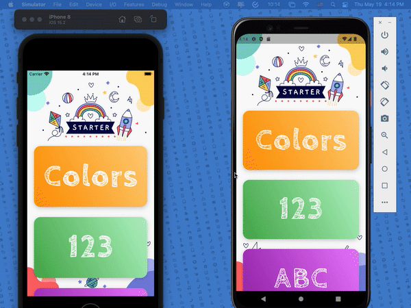

# 英语学习软件 for Kids

一个基于 [md-siam/kid_starter](https://github.com/md-siam/kid_starter) 开源项目二次开发的幼儿英语启蒙 APP，融合了 [EkaAI-Tech/learn](https://github.com/EkaAI-Tech/learn/releases) 的词汇扩展思路，支持自定义“名字 + Logo + 内置课程 + 音频/视频资源 + 打包 APK”。

这个项目面向中国 3-6 岁、只会说中文、几乎没有英语基础的小朋友，尽量用图片、语音、动画、点击互动来帮助孩子听得懂、学得会、愿意开口。

## 网盘下载

> 百度网盘下载链接：
>
> [https://pan.baidu.com/s/19vMQgyZriOMK39zuOdY1mw?pwd=m33d](https://pan.baidu.com/s/19vMQgyZriOMK39zuOdY1mw?pwd=m33d)
>
> 提取码：`m33d`

官方主页：https://10000yun.com/

教程及配置：https://10000yun.com/2487.html

关注公众号：玩云盒

灵感来自：[md-siam/kid_starter](https://github.com/md-siam/kid_starter) [EkaAI-Tech/learn](https://github.com/EkaAI-Tech/learn/releases)

英语学习软件-完整源码：

[cheerqjy/kid_starter_learn](https://github.com/cheerqjy/kid_starter_learn)

https://gitee.com/cheerqjy/kid_starter_learn

## 项目定位

这是一个偏“启蒙教学”而不是“考试刷题”的英语学习软件，设计重点是：

- 少文字、强语音、强点击反馈
- 先听懂、再辨认、再跟读
- 每个模块尽量一页一目标，避免操作过深
- 支持离线核心资源，减少网络依赖
- 支持 APK 打包，方便直接安装到手机或 PAD

## 核心功能

- `ABC`：26 个字母基础认知
- `123`：数字启蒙，支持 0-20 发音学习
- `Colors`：颜色学习
- `Animals / Birds`：动物与鸟类词汇
- `Shapes`：基础图形认知与发音
- `ABC Sounds`：字母发音闯关，支持联网缓存视频、分关学习、本关视频连播
- `Phonics`：音标与基础发音启蒙，支持直接听音标、听例词、跟读
- `Where?`：介词方位学习，带动态场景演示
- `Stories`：短句故事启蒙，适合反复听读
- `Body / Fruit Veggie / Flowers / Jobs / Seasons / Space`：扩展词汇模块
- `For Parents`：家长入口、学习进度与学习报告

## 当前版本亮点

- 保留 `kid_starter` 原有“点击即播放”的低门槛交互
- 大量补充 `learn` 项目的启蒙内容到统一课程结构中
- 新增内置音频资源，减少依赖手机系统 TTS 导致的无声问题
- `ABC Sounds` 接入在线视频并自动缓存到本地
- 新增学习进度记录、星星奖励、家长学习报告
- 首页按难度重排课程路线：`ABC -> 123 -> Colors -> Animals -> Shapes -> ABC Sounds -> Phonics -> Where? -> Stories`
- 面向低龄儿童优化：大卡片、大按钮、少层级、强反馈

## 适用场景

- 幼儿园大班英语启蒙
- 家长陪学
- 平板点读式学习
- 早教机构或家庭场景中的词汇启蒙

## 运行演示

> 下面是项目当前内置的演示动图，实际模块已经在此基础上继续扩展。

<p align="center">
  
</p>

## 课程路线建议

推荐给孩子的学习顺序：

1. `ABC`
2. `123`
3. `Colors`
4. `Animals`
5. `Shapes`
6. `ABC Sounds`
7. `Phonics`
8. `Where?`
9. `Stories`
10. 扩展词汇模块

这样安排更符合 3-6 岁零基础孩子的接受习惯，先建立“看图能懂、点了有声音”的学习信心，再逐步过渡到发音、音标、句子和情景理解。

## 模块说明

### 1. 基础认知模块

- `ABC`：认识大写和小写字母
- `123`：认识数字并听发音
- `Colors`：建立颜色英文对应
- `Shapes`：认识基础形状词汇

### 2. 发音启蒙模块

- `ABC Sounds`：按字母分组闯关，支持字母音、例词、视频磨耳朵
- `Phonics`：用更直观的方式学习基础音标和发音口型

### 3. 情景理解模块

- `Where?`：通过动画理解 `in / on / under / behind / between / through` 等介词
- `Stories`：用短小故事帮助孩子建立简单句语感

### 4. 扩展词汇模块

- 身体部位
- 水果蔬菜
- 花朵
- 职业
- 四季
- 太空
- 动物与鸟类

### 5. 家长陪学模块

- 学习进度记录
- 视频观看记录
- 星星奖励统计
- 学习建议与下一步推荐

## 自定义能力

这个项目适合继续做成自己的品牌版本，当前代码结构已经支持继续定制：

- 自定义 APP 名称
- 自定义 Logo 和启动图
- 自定义首页课程顺序
- 自定义词汇内容与模块数量
- 自定义内置音频资源
- 自定义在线视频地址
- 自定义包名后打包 APK

如果你要做自己的发布版，通常只需要继续改这几类内容：

- `lib/app/screens/`
- `lib/app/controllers/`
- `assets/images/`
- `assets/audio/`
- `android/app/src/main/`

## 技术栈

- Flutter 3
- Dart
- just_audio
- flutter_tts
- video_player
- flutter_cache_manager
- shared_preferences
- google_fonts

## 目录结构

```text
lib/
├─ app/
│  ├─ controllers/
│  ├─ models/
│  ├─ screens/
│  ├─ services/
│  ├─ utils/
│  ├─ widgets/
│  ├─ constant.dart
│  └─ splash_screen.dart
├─ generated_plugin_registrant.dart
└─ main.dart

assets/
├─ audio/
│  ├─ alphabet_en/
│  ├─ animals/
│  ├─ birds/
│  ├─ color/
│  ├─ numeric_en/
│  └─ tts/
├─ images/
└─ fonts/
```

## 本地运行

```bash
flutter pub get
flutter run
```

## 打包 APK

建议直接打 `release` 包用于真机测试：

```bash
flutter build apk --release
```

生成路径：

```text
build/app/outputs/flutter-apk/app-release.apk
```

## 视频与音频说明

- 核心启蒙模块优先使用内置音频
- `ABC Sounds` 可接入服务器视频资源
- 视频支持在线播放和本地缓存
- 适合做“看视频磨耳朵 + 点击学发音”的混合式启蒙

## 后续可继续扩展

- 正式应用图标和品牌包装
- 更多动画奖励效果
- 更完整的家长学习报告
- 课程解锁和阶段性闯关
- 更多故事、自然拼读和情景对话内容
- Web 管理后台

> 说明：当前仓库以移动端 APP 源码为主，`Web 管理后台` 属于后续可扩展方向，尚未包含在本仓库内。

## License

本项目基于原始开源项目继续开发，原项目使用 `MIT License`。

二次开发时请同时尊重：

- 原始开源项目许可证
- 第三方素材和资源的使用范围
- 你自己新增内容的版权归属

## 致谢

- [md-siam/kid_starter](https://github.com/md-siam/kid_starter)
- [EkaAI-Tech/learn](https://github.com/EkaAI-Tech/learn/releases)
- Flutter 开源社区
- 所有为儿童启蒙教育提供素材和思路的开发者
